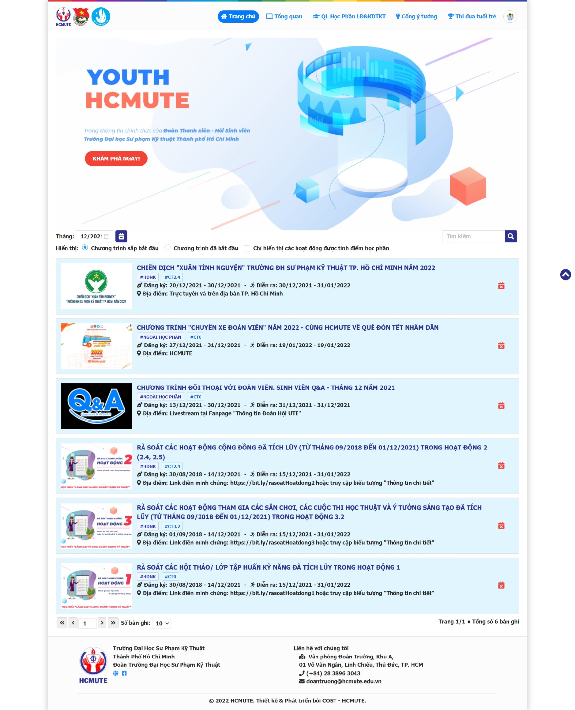
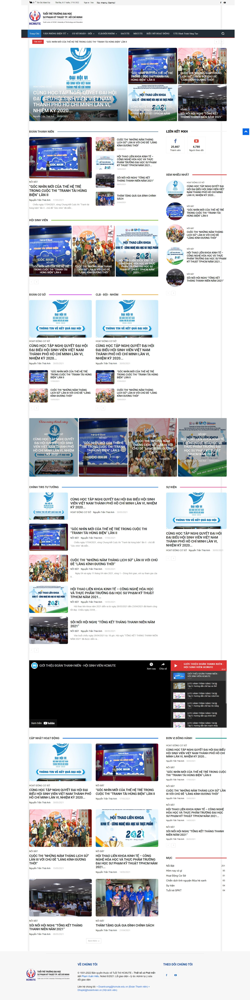
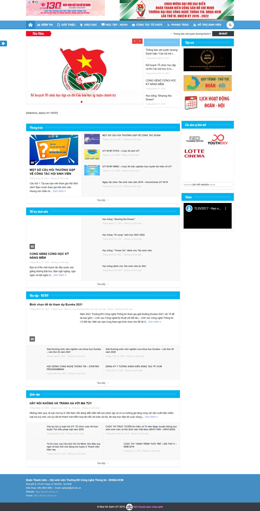

# KHẢO SÁT HIỆN TRẠNG

### Mục lục

1. [Youth HCMUTE](#youth-hcmute)
2. [Tuổi trẻ HCMUTE](#tuoitre-hcmute)
3. [Tuổi trẻ UIT](#tuoitre-uit)
4. [Kết luận](#summary)
## Youth HCMUTE

| Tiêu chí | Mô tả |
| --- | --- |
| Link | https://youth.hcmute.edu.vn/ |
| Giới thiệu | Website quản lý các chương trình trong học phần `Lãnh đạo và Kinh doanh trong kỹ thuật` của Đoàn Thanh niên - Hội Sinh viên trường ĐH Sư phạm Kỹ thuật TPHCM. |
| Chức năng | - Hiển thị danh sách, tìm kiếm các chương trình.   - Thống kê tổng quan.   - Quản lý tiến độ học phần.   - Đóng góp ý tưởng sáng tạo. |
| Ưu điểm | Giao diện đơn giản, phát triển ứng dụng nhanh chóng. |
| Nhược điểm | - Chưa responsive, thiết kế giao diện rập khuôn.   Các chức năng chưa đa dạng, khó sử dụng. |
| Ảnh | 

## TuoiTre HCMUTE

| Tiêu chí | Mô tả |
| --- | --- |
| Link | https://tuoitre.hcmute.edu.vn/ |
| Giới thiệu | Website chính thức của Đoàn Thanh niên - Hội Sinh viên trường ĐH Sư phạm Kỹ thuật TPHCM. |
| Chức năng | - Danh mục các chương trình đang diễn ra.   - Tin tức.   - Thống kê các hoạt động tại cơ sở/ CLB/ Đội/ Nhóm.   - Biểu đồ hoạt động Đoàn - Hội.   - Lịch công tác.   - Danh bạ Đoàn - Hội.   - Thông tin các văn bản đã ban hành. |
| Ưu điểm | Đảm bảo các chức năng cơ bản, dễ sử dụng. |
| Nhược điểm | - Giao diện chưa responsive.   - Thiết kế không hài hòa.   - Mang lại trải nghiệm người dùng không tốt.|
| Ảnh |  |

## TuoiTre UIT

| Tiêu chí | Mô tả |
| --- | --- |
| Link | https://tuoitre.uit.edu.vn/ |
| Giới thiệu | Website chính thức của Đoàn Thanh niên - Hội Sinh viên trường ĐH Công nghệ Thông tin - ĐHQGHCM. |
| Chức năng | - Điểm tin.   - Giới thiệu Đoàn - Hội.   - Tuyên truyền, giáo dục.   - Học tập, NCKH, ngân hàng ý tưởng, các cuộc thi học thuật.   - Công tác, nghiệp vụ Đoàn - Hội, điểm rèn luyện, điểm CTXH.   - Phong trào Sinh viên 5 tốt.   - Các hoạt động đội nhóm.   - Tư vấn, hỗ trợ sinh viên.   - Lịch công tác, hoạt động.   - Quy trình, thủ tục. |
| Ưu điểm | - Giao diện thân thiện, dễ thao tác.   - Chức năng đáp ứng nghiệp vụ Đoàn - Hội.   - Responsive. |
| Nhược điểm | Mẫu thiết kế giao diện đơn giản sử dụng Wordpress, không bắt kịp xu thế. |
| Ảnh |  |

## Summary

Dựa trên những khảo sát thực tế về 3 website nêu trên, ta có thể thấy rằng:
- Các website phần lớn chưa đáp ứng đủ các nhu cầu thục tiễn trong công tác Đoàn - Hội. 
- Giao diện website còn nhiều lỗi, chưa responsive.
- Nhiều trang web đang bỏ dỡ, không được duy trì.